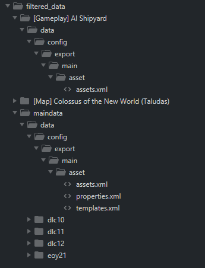

# Anno 1800 Mod Creator

This project creates Anno 1800 mods using the data from the input path argument and writes them to output path argument

The input path is expected to contain the extracted contents of the .rda files of the game in a maindata subdirectory and any mods in their individual subdirectory.

Example of my input path called filtered_data:

